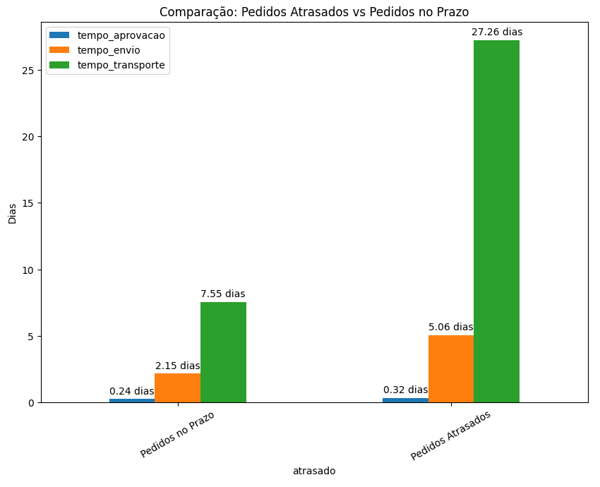
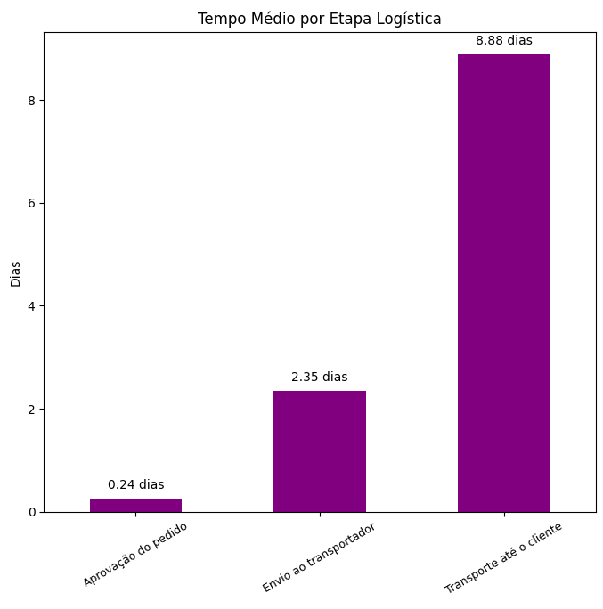

# Análise Logística e Satisfação do Cliente no E-commerce Brasileiro

## Objetivo do Projeto

Este projeto analisa dados do marketplace Olist para identificar como a eficiência logística impacta a satisfação do cliente e o desempenho operacional do e-commerce.

O estudo foi desenvolvido como parte do Tech Challenge da pós-graduação em Data Analytics.

---

## Acessar Notebook

[Abrir no Google Colab](https://colab.research.google.com/drive/1SMQcyc3CTOTPIzyieCguKXSrjrk7s-3U?usp=sharing)

---
## Tecnologias Utilizadas

- Python
- Pandas
- Matplotlib
- Google Colab
- Data Analysis
- Data Visualization

---

## Principais Insights

- Pedidos atrasados tiveram queda de aproximadamente 47% na satisfação dos clientes
- O transporte foi identificado como principal gargalo logístico
- Regiões Norte e Nordeste apresentaram maiores índices de atraso
- O tempo total de entrega impacta mais a satisfação do que apenas o cumprimento do prazo

---
## Visualizações

### Comparação entre pedidos atrasados e entregues no prazo

Este gráfico evidencia que o principal gargalo operacional está na etapa de transporte, responsável pela maior diferença entre pedidos entregues no prazo e pedidos atrasados.

---

### Tempo médio por etapa logística

A análise mostra que a etapa de transporte concentra a maior parte do lead time logístico, impactando diretamente a experiência do cliente e a satisfação com a entrega.

---

## Estrutura da Análise

- Tratamento de dados
- Análise exploratória
- Correlação entre atraso e review score
- Lead time logístico
- Análise regional
- Recomendações estratégicas

---

## Avaliação Acadêmica

O projeto recebeu nota máxima (90/90) no Tech Challenge da pós-graduação em Data Analytics da FIAP.

Feedback do professor:

> “O relatório apresentado está em sintonia com o perfil de um documento estratégico voltado para a alta gestão.”

> “Há equilíbrio entre profundidade técnica e aplicabilidade prática.”

> “O storytelling conduz o leitor com fluidez desde o problema até a conclusão.”

---
## Dataset

Brazilian E-Commerce Public Dataset by Olist.

---

## Arquivos do Projeto

- Notebook completo da análise em Python
- Relatório executivo em PDF
- Visualizações gráficas

---

## Autor

Rhoney Mathias
